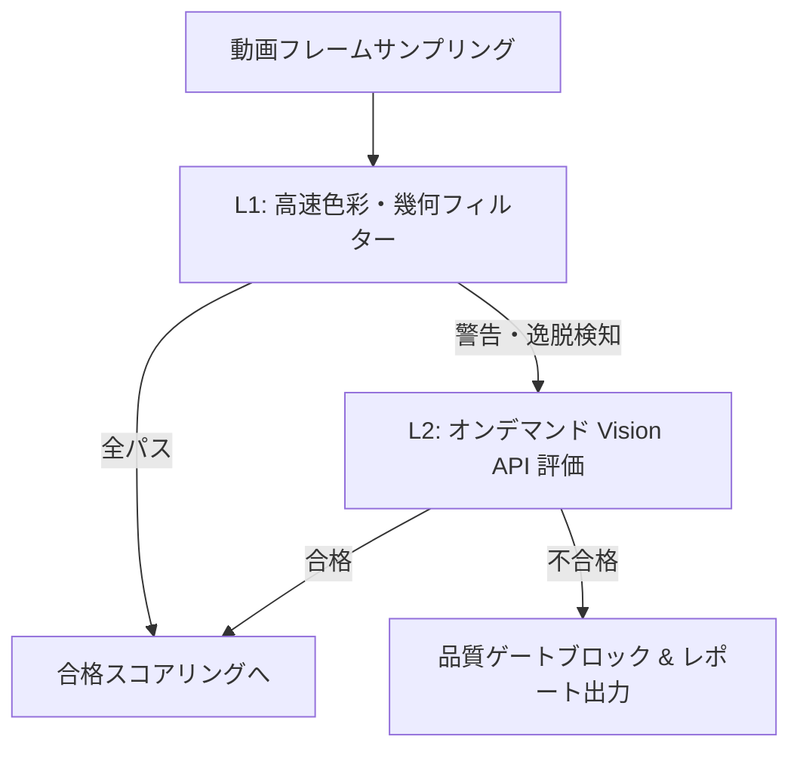

# 設計ドラフト: 動画品質検証ハーネスおよび段階的品質ゲートエンジン (IMP-QUALITY-SWEEP)

## 概要
憲法第8.2条（品質ゲート）および第16.5条（段階的レビュー）に基づき、動画レンダリング前に「テロップ視認性」「セーフエリアはみ出し」「ブランドトーン」を自動測定する品質検証ハーネスの設計。APIコストと処理速度を最適化するため、Pillow/OpenCVによる超高速色彩・幾何計算（L1）と、警告検知フレームのみを対象とする Gemini Vision レビュー（L2）を組み合わせた「ハイブリッド③型」アーキテクチャの設計ドラフト。

## 1. 段階的品質検証プロセス（ハイブリッド③）

### ① L1: 高速色彩・幾何フィルター (Fast Geometric & Contrast Filter) — APIコスト: 0円
- OpenCV/Pillow を用いて、テキストが描画される予定のバウンディングボックス（描画エリア）をスキャンする。
- **色彩（コントラスト）判定**:
  - 描画背景領域の平均輝度（Luminance）と、適用されるテロップテキスト色（`design_tokens.json` 由来）のコントラスト比を計算する。
  - WCAG 2.1 ガイドライン（コントラスト比最低 4.5:1）を下回る場合、L2への評価要求をトリガーする。
- **幾何（セーフエリア）判定**:
  - テキスト座標が、番組/動画標準のセーフエリア境界（一般的に画面端から10%内側）に収まっているかを数学的に計算。はみ出している場合はL2をトリガー。

### ② L2: オンデマンド Vision API レビュー (On-Demand Vision Review) — コスト最小化
- L1で「コントラスト警告」または「セーフエリア警告」が発生したフレーム、あるいはシーン遷移（トランジション）などの重要キーフレーム（全体の数%程度）のみを画像としてサンプリング抽出。
- Gemini-3-Flash (Vision) に画像と以下のプロンプトを入力し、構造化データで評価を得る。
  - *プロンプト*: 「画像内の指定領域にある字幕テキストについて、背景との重なりによる見づらさ、フォントの崩れ、文字の見切れがないか評価してください。」
  - *返却型*: `{"is_readable": boolean, "clarity_score": 0-100, "issue_description": "..."}`

## 2. 品質ゲート（Quality Gate）の判定と処理
- **品質スコアの算出**:
  - 判定結果を統合し、`L1合格率 (40点) + L2視認性スコア (40点) + 音声ラウドネス適合率 (20点)` で 100点満点の動画品質スコアを算出。
- **ブロックポリシー**:
  - 品質スコアが **90点未満** の場合、最終レンダリング処理をブロックし、警告箇所と画像のBefore/After（不具合箇所ハイライト）を含んだ HTML 品質レポート（Progressive Preview 形式）を出力して管理者に通知する。

## 3. セルフチェックリスト / 完了条件
- [ ] テロップ座標と背景輝度のコントラスト比を計算する `contrast_analyzer.py` の実装
- [ ] L1でフラグが立ったフレームのみをサンプリングし、Vision API を呼ぶ `vision_quality_checker.py` の実装
- [ ] 90点未満でのブロック処理および HTML品質レポート生成関数の実装
- [ ] 全フィットネス関数テストが PASS すること

---

### [2026-05-23 19:02] ユーザー合意および仕様決定 (議長合意)
- **判定方式の決定**: 0円で超高速に動く「L1: 高速色彩・幾何計算」と、そこで異常警告が発生したフレームのみを対象に Vision API を呼ぶ「L2: オンデマンド Vision レビュー」のハイブリッド③型を正式採用。
- **品質ゲート要件**: 最終スコアが 90点未満の場合はレンダリングを自動でブロックし、プレビューつきの品質レポートを生成して管理者にエスカレーション（保留）する。
