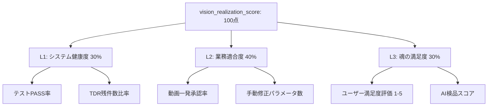

# 設計ドラフト: ビジョン実現度自動測定エンジンおよび判断層移行設計 (IMP-VISION-SCORE)

## 概要
憲法第4.4条に基づき、システムが「判断層（評議会エージェントによる合議意思決定）」に移行するための基準となる『ビジョン実現度（`vision_realization_score`）』を、ユーザーに余計な入力負荷をかけずに自動収集する。システム健康度（技術）・業務効率性（行動）・魂の適合度（満足度）の3層から構成される【3層自動テレメトリー・ハイブリッド評価】エンジンの設計ドラフト。

## 1. 3層評価マトリクス（3-Tier Evaluation Matrix）

ビジョン実現度は 100点満点 で算出し、以下の3つのレイヤーの加重平均で構成する。

### ① L1: システム健康度 (System Health / 技術基盤) — 配点: 30点
- **目的**: 土台となるプログラムがバグなく、クリーンに保たれているかを自動測定する。
- **指標**:
  - 全テスト（フィットネス関数、E2E含む）の合格率（%） $\times$ 15点
  - 技術負債（TDR）の未解消件数の減少率（%） $\times$ 15点

### ② L2: 業務適合度 (Workflow Efficiency / 行動推測) — 配点: 40点
- **目的**: ユーザーが「どれだけ快適に、手を動かさずに編集できたか」を行動ログから自動的に推測する。
- **指標**:
  - **一発OK率（自動承認率）**: 生成された最初の動画が、手動調整なしにそのまま「承認」された割合 $\times$ 20点
  - **手動編集の少なさ**: ユーザーが手動で書き換えたパラメータ（BGM調整や字幕修正）の少なさ（修正パラメータ数が0に近いほど高得点） $\times$ 20点
  - *背景*: ユーザーが何も言わずに「一括適用」して一発で承認した＝AIが好みを完全に把握していると機械的に見なす。

### ③ L3: 魂の満足度 (Soul Alignment / 定性評価) — 配点: 30点
- **目的**: ユーザーが主観的に「この動画は魂がこもっている」と感じたか、およびAI自己検品の客観的な品質スコア。
- **指標**:
  - 生成動画プレビュー時の「クイック星評価（1〜5）」または「👍👎」 $\times$ 15点（未入力時は前回の値を引き継ぐ）
  - 自己改善ループにおけるAI検品（NHK基準・YouTuber基準等）の品質合格スコアの平均 $\times$ 15点

## 2. 判断層（評議会）への移行トリガー
- `vision_realization_score` が **70点以上を3回連続で維持** した場合、システム状態を `phase_state.json` にて「移行可能（ready_for_council）」と更新する。
- 移行後は、動画の編集ディレクション（BGMや構成の決定）を、単一のWorkerスクリプトではなく、`Strategist`, `Director`, `Analyst` の各エージェントが自律的に提案・合議し、合意形成（Consensus）した結果をレンダリングする「エージェント評議会モード」が稼働する。

## 3. セルフチェックリスト / 完了条件
- [ ] 3層指標（L1/L2/L3）のデータをテレメトリー収集し、スコアを算出する `vision_score_calculator.py` の実装
- [ ] ユーザーの承認・却下およびパラメータ手動修正履歴を収集するフック（ログシリアライザ）の実装
- [ ] スコア算出および 70点以上での評議会移行フラグの有効化を検証するユニットテスト
- [ ] 全フィットネス関数テストが PASS すること

---

### [2026-05-23 18:45] ユーザー合意および仕様決定 (議長合意)
- **測定のベストプラクティス**: ユーザーの入力負担を最小化するため、ユーザーの行動ログ（一発承認率や手動微調整の有無）から定性的な満足度を裏で推測して自動収集する「3層自動テレメトリー・ハイブリッド評価」を基本方針として決定。
- **移行条件**: 実現スコア 70点以上を3回連続維持した時点で、エージェント合議体（判断層）への移行準備完了とする。
