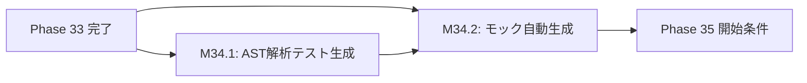

# 設計書ドラフト: Phase 34 — 自律テスト生成 & モック自動生成

## 1. 概要

### 目的
AST解析に基づくテスト自動生成エンジンと、外部依存をモック化する自動モック生成機構を構築し、テストカバレッジを持続的に向上させる基盤を確立する。人手によるテスト作成のボトルネックを排除し、Flashセッションが自律的にカバレッジを拡大できる仕組みを実現する。

### スコープ
- `ast_test_generator.py` の拡張（5モジュール対応）
- モック自動生成エンジン（`auto_mock_generator.py`）の新規実装
- カバレッジ 60% 達成に向けたテスト追加
- 既存の `InlineCoverageExtender` との統合

### スコープ外
- E2Eテストの自動生成（Phase 39で対応）
- フロントエンドのテスト自動生成

---

## 2. 前提条件

| 条件 | 値 | 根拠 |
|------|-----|------|
| Phase 33 ゲート通過済み | coverage_pct >= 45.0 | phase_gates.json |
| critical_debt | <= 15 | Phase 33 完了基準 |
| ast_test_generator.py | 稼働中 | Phase 33 で基盤実装済み |
| pytest全テストPASS | 必須 | GEMINI.md 実行前チェック |

---

## 3. マイルストーン定義

### M34.1: AST解析からのテスト自動生成 5モジュール

**完了条件:**
1. `ast_test_generator.py` が以下の5モジュールに対してテスト雛形を自動生成できること:
   - `backend/video_pipeline/pipeline_coordinator.py`
   - `backend/api/projects_router.py`
   - `backend/api/videos_router.py`
   - `backend/services/video_service.py`
   - `backend/services/project_service.py`
2. 生成されたテストが `pytest` で構文エラーなく実行できること
3. 各モジュールの公開関数・メソッドの少なくとも 80% に対してテストスタブが生成されること
4. AST解析で検出した分岐（if/else/try/except）に対して、正常系・異常系の両方のテストケースが生成されること

**具体的な実装指針:**
- `ast.parse()` でソースコードを解析し、`FunctionDef` / `AsyncFunctionDef` を抽出
- 引数の型ヒントから `pytest.fixture` のテンプレートを生成
- `return` 文の型から `assert` 文のテンプレートを生成
- `raise` 文から異常系テストケース（`pytest.raises`）を自動生成

### M34.2: モック自動生成 + Coverage 60% 達成

**完了条件:**
1. `auto_mock_generator.py` が外部依存（DB接続、APIクライアント、ファイルI/O）を検出し、適切なモックを自動生成できること
2. 生成されたモックが `unittest.mock.MagicMock` / `AsyncMock` を正しく使用すること
3. subprocess.Popen のモックは `safe_popen_mock` fixture パターンに準拠すること（GEMINI.md モック安全規約）
4. プロジェクト全体のカバレッジが **60% 以上** に到達すること
5. カバレッジ改善規約に基づき、変更対象モジュールは A分類（カバー必須100%）として扱うこと

**具体的な実装指針:**
- `import` 文を解析し、外部ライブラリ依存を検出
- `conftest.py` に配置する共通モック fixture を自動生成
- DB セッション（`get_db`）、HTTPクライアント、subprocess 呼び出しのパターンマッチング
- `poll()` は `return_value=0`、`readline()` は `""` を返すモック（GEMINI.md準拠）

---

## 4. タスクグループ定義

### test_weaver（配分: 40%）
- **対象**: M34.1 の 5モジュールに対するテスト自動生成
- **タスク粒度**: 1モジュール = 1タスク（計5タスク）
- **具体的指示テンプレート**:
  ```
  {target_module} のAST解析を行い、全公開関数のテストを自動生成せよ。
  - ast.parse() で FunctionDef/AsyncFunctionDef を抽出
  - 型ヒントから fixture テンプレートを生成
  - 正常系・異常系（raise文から pytest.raises）の両方を生成
  - 生成先: tests/test_{module_name}_auto.py
  - pytest で構文エラーなく実行できることを確認
  ```
- **成功判定**: `pytest tests/test_{module}_auto.py` が全PASS

### bug_hunter（配分: 15%）
- **対象**: 既存の `ast_test_generator.py` のバグ修正・エッジケース対応
- **タスク粒度**: バグ報告ベース
- **具体的指示テンプレート**:
  ```
  ast_test_generator.py の以下のエッジケースを修正せよ:
  - デコレータ付き関数の解析失敗
  - *args/**kwargs を含む関数シグネチャの処理
  - ネストされたクラス内メソッドの抽出漏れ
  ```
- **成功判定**: 修正対象のエッジケースに対するテストがPASS

### refactor（配分: 15%）
- **対象**: テスト生成エンジンのコード品質改善
- **タスク粒度**: 関数/クラス単位
- **具体的指示テンプレート**:
  ```
  ast_test_generator.py の {target_function} をリファクタリングせよ:
  - 関数長が50行を超える場合は分割
  - 重複コードの DRY 化
  - 型ヒントの追加
  - docstring の追加/更新
  ```
- **成功判定**: リファクタ後に pytest 全PASS + カバレッジ非退行

### coverage（配分: 25%）
- **対象**: カバレッジ 60% 達成に向けた手動テスト追加
- **タスク粒度**: 未カバー行の多いモジュール上位10件
- **具体的指示テンプレート**:
  ```
  {target_module} のカバレッジを向上せよ。
  - coverage.json から未カバー行を特定
  - A/B/C分類を実施（カバレッジ改善規約準拠）
  - A分類行は100%カバー必須
  - テスト追加後、coverage_pct の増分を報告
  ```
- **成功判定**: 対象モジュールのカバレッジが 10% 以上向上

### doc_gen（配分: 5%）
- **対象**: AST解析エンジンおよびモック自動生成の技術ドキュメント
- **タスク粒度**: ドキュメント1件 = 1タスク
- **具体的指示テンプレート**:
  ```
  以下のドキュメントを生成せよ:
  - auto_mock_generator.py の使い方ガイド
  - テスト自動生成の設計判断書（なぜAST解析を選択したか）
  - 生成されたテストの品質基準チェックリスト
  ```
- **成功判定**: ドキュメントが Markdown 形式で作成され、コードサンプルを含むこと

---

## 5. リスクと緩和策

| リスク | 影響度 | 緩和策 |
|--------|--------|--------|
| AST解析が複雑なデコレータチェーンを正しく処理できない | 中 | パターンマッチングのフォールバック実装。未解析関数はスキップしてログ出力 |
| 自動生成テストが意味のないアサーション（`assert True`）になる | 高 | 生成後のバリデーションステップで `assert True/False` の検出・除去 |
| モック自動生成が subprocess のモック安全規約に違反する | 高 | `safe_popen_mock` fixture の強制適用チェックをCIに組み込む |
| カバレッジ 60% 未達 | 中 | 未カバー行の A/B/C分類で優先度を明確化し、A分類から着手 |
| 生成テストが既存テストと名前衝突する | 低 | `_auto` サフィックスによる名前空間分離 |

---

## 6. 完了基準

| 基準 | 閾値 | 検証方法 |
|------|------|----------|
| coverage_pct | >= 50.0 | `pytest --cov` 実行結果 |
| critical_debt | <= 10 | `TechnicalDebtStore.get_open_critical_count()` |
| 5モジュール自動生成 | 全モジュール完了 | 生成テストファイルの存在確認 + pytest PASS |
| モック自動生成稼働 | `auto_mock_generator.py` テスト全PASS | pytest 実行結果 |
| pytest 全テスト PASS | 0 failures | CI/CD パイプライン |
| ラチェット非退行 | 全指標が前回以上 | `pytest tests/test_ux_ratchet.py` |

---

## 7. 依存関係


