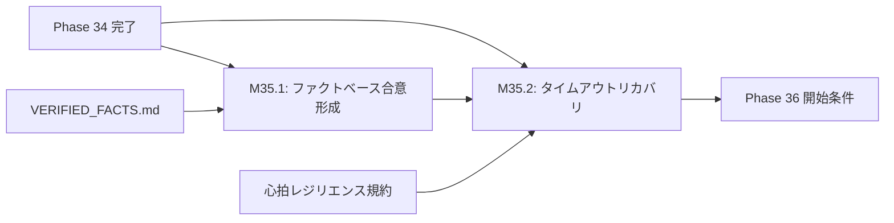

# 設計書ドラフト: Phase 35 — Nexus-Council 3.0 & 評議会高度化

## 1. 概要

### 目的
Nexus-Council（マルチエージェント評議会）を 3.0 にアップグレードし、ファクト（VERIFIED_FACTS.md）ベースの合意形成メカニズムを実装する。エージェント間のタイムアウト自律リカバリ機構を追加し、3エージェント協調による設計判断の自動化を実現する。

### スコープ
- ファクトベース合意形成アルゴリズムの設計・実装
- タイムアウト自律リカバリ機構（ハートビート監視 + 自動フェイルオーバー）
- 3エージェント協調テスト（Opus / Flash / Nexus-Council）
- 評議会の議事録自動生成・アーカイブ

### スコープ外
- 4エージェント以上の協調（将来フェーズで検討）
- 外部サービス（Slack等）への評議会結果通知

---

## 2. 前提条件

| 条件 | 値 | 根拠 |
|------|-----|------|
| Phase 34 ゲート通過済み | coverage_pct >= 50.0, critical_debt <= 10 | phase_gates.json |
| VERIFIED_FACTS.md | 最新状態 | ファクトベース合意の入力データ |
| Orchestration Hub | 稼働中 | hub_common.py, hub_gate.py |
| 心拍レジリエンス規約 | 適用中 | GEMINI.md 心拍レジリエンス規約 |

---

## 3. マイルストーン定義

### M35.1: ファクトベース合意形成メカニズム実装

**完了条件:**
1. `consensus_engine.py` を新規実装し、以下の機能を持つこと:
   - VERIFIED_FACTS.md から検証済みファクトを構造化データとして読み込み
   - 設計判断の提案に対して、関連ファクトを自動引用
   - 3エージェント間の投票（賛成/反対/棄権）メカニズム
   - 合意形成の閾値: 3エージェント中2以上の賛成で合意（多数決）
   - ファクトとの矛盾が検出された場合、自動的にエスカレーション（EP該当）
2. 合意形成プロセスの議事録が JSON 形式で自動記録されること
3. 議事録に以下が含まれること:
   - タイムスタンプ、提案内容、引用ファクト、各エージェントの投票理由、最終判定
4. テストカバレッジ: `consensus_engine.py` のカバレッジ 80% 以上

**具体的な実装指針:**
- `backend/agents/memory/VERIFIED_FACTS.md` をパースする `fact_parser.py` を実装
- 各ファクトをベクトル化し、提案テキストとの類似度でランキング
- 投票プロトコル: 各エージェントが `{vote: "agree"|"disagree"|"abstain", reason: "...", cited_facts: [...]}` を返却
- 合意結果は `backend/agents/memory/council_minutes/` に保存

### M35.2: タイムアウト自律リカバリ + 3エージェント協調テスト

**完了条件:**
1. エージェントがタイムアウト（60秒無応答）した場合、自動的にリカバリが発動すること:
   - Step 1: ハートビート確認（3回リトライ、各10秒間隔）
   - Step 2: リトライ失敗時、代替エージェントにフェイルオーバー
   - Step 3: フェイルオーバー結果を議事録に記録
2. 3エージェント協調テストが全PASS:
   - テスト1: 正常合意形成（3エージェント全賛成）
   - テスト2: 多数決合意（2賛成 / 1反対）
   - テスト3: 合意不成立（1賛成 / 2反対）→ エスカレーション
   - テスト4: タイムアウトリカバリ（1エージェント無応答 → フェイルオーバー）
   - テスト5: ファクト矛盾検出 → 自動停止
3. 心拍レジリエンス規約との整合: 3段階自動停止（STALE/UNREACHABLE/DEAD）に対応

**具体的な実装指針:**
- `asyncio.wait_for()` によるタイムアウト制御
- `health_check.py` の `_auto_stop_stale_session()` パターンを踏襲
- テスト時は `unittest.mock.AsyncMock` で各エージェントの応答をシミュレート

---

## 4. タスクグループ定義

### test_weaver（配分: 35%）
- **対象**: `consensus_engine.py`, `fact_parser.py`, タイムアウトリカバリ
- **タスク粒度**: 機能単位（投票メカニズム / ファクト引用 / タイムアウト）
- **具体的指示テンプレート**:
  ```
  consensus_engine.py の {target_function} に対するテストを作成せよ。
  - 正常系: 3エージェント全賛成で合意成立
  - 異常系: タイムアウト発生時のフェイルオーバー
  - 境界値: 2賛成/1反対の多数決
  - ファクト矛盾検出時のエスカレーション
  - AsyncMock を使用してエージェント応答をシミュレート
  ```
- **成功判定**: 対象テスト全PASS + カバレッジ 80% 以上

### bug_hunter（配分: 20%）
- **対象**: 既存の評議会関連コード、Orchestration Hub との統合部分
- **タスク粒度**: バグ報告ベース + 静的解析結果
- **具体的指示テンプレート**:
  ```
  評議会関連コードの以下の潜在バグを調査・修正せよ:
  - 合意形成中にエージェントが切断された場合のリソースリーク
  - 議事録JSON書き込みのアトミック性確保（一時ファイル経由のリネーム）
  - VERIFIED_FACTS.md のパース時にマークダウン構文エラーが混入した場合の耐障害性
  ```
- **成功判定**: 修正後に pytest 全PASS + 該当バグの再現テスト追加

### refactor（配分: 20%）
- **対象**: 既存の Orchestration Hub コードの評議会対応リファクタ
- **タスク粒度**: モジュール単位
- **具体的指示テンプレート**:
  ```
  hub_common.py / hub_gate.py に評議会連携インターフェースを追加せよ:
  - 設計判断が必要な場合に consensus_engine を呼び出すフック
  - 評議会結果に基づくゲート通過判定の拡張
  - ログ出力に評議会結果サマリーを含める
  ```
- **成功判定**: リファクタ後に pytest 全PASS + 評議会呼び出しのインテグレーションテスト追加

### coverage（配分: 20%）
- **対象**: カバレッジ 55% 達成に向けた未カバーモジュール
- **タスク粒度**: A/B/C分類に基づく優先度順
- **具体的指示テンプレート**:
  ```
  coverage 55% 達成に向けて {target_module} のテストを追加せよ。
  - A分類（直接変更モジュール）: consensus_engine.py, fact_parser.py → 100%カバー
  - B分類（依存基盤）: hub_common.py, hub_gate.py → 推奨カバー
  - C分類: TDR登録で管理
  ```
- **成功判定**: coverage_pct >= 55.0

### doc_gen（配分: 5%）
- **対象**: 評議会アーキテクチャドキュメント
- **タスク粒度**: ドキュメント1件 = 1タスク
- **具体的指示テンプレート**:
  ```
  以下のドキュメントを作成せよ:
  - Nexus-Council 3.0 アーキテクチャ概要図（Mermaid）
  - ファクトベース合意形成アルゴリズムの設計判断書
  - タイムアウトリカバリのシーケンス図
  ```
- **成功判定**: Markdown形式 + Mermaid図を含むドキュメントの作成

---

## 5. リスクと緩和策

| リスク | 影響度 | 緩和策 |
|--------|--------|--------|
| VERIFIED_FACTS.md のパースが不安定 | 高 | 厳格なMarkdownパーサー + フォールバック（正規表現ベース） |
| 3エージェント協調テストのタイミング依存バグ | 中 | `asyncio.Event` による同期制御 + テストタイムアウト60秒 |
| 評議会の合意がデッドロック | 中 | 最大投票ラウンド数（3回）の制限 + 議長決裁フォールバック |
| 心拍レジリエンス規約との不整合 | 高 | 3段階自動停止の閾値テストを M35.2 に含める |
| 議事録の肥大化 | 低 | 30日経過した議事録の自動アーカイブ |

---

## 6. 完了基準

| 基準 | 閾値 | 検証方法 |
|------|------|----------|
| coverage_pct | >= 55.0 | `pytest --cov` 実行結果 |
| critical_debt | <= 5 | `TechnicalDebtStore.get_open_critical_count()` |
| consensus_engine.py | テスト全PASS + カバレッジ80%以上 | pytest 実行結果 |
| 3エージェント協調テスト | 5テストケース全PASS | pytest 実行結果 |
| タイムアウトリカバリ | 60秒以内にフェイルオーバー完了 | テスト計測 |
| pytest 全テスト PASS | 0 failures | CI/CD パイプライン |
| ラチェット非退行 | 全指標が前回以上 | `pytest tests/test_ux_ratchet.py` |

---

## 7. 依存関係



---

## 8. 既存モジュール棚卸し（C2/C5基準対応）

Phase 35で変更対象となる既存モジュールの詳細情報。Flashのタスク成功率とTIMEOUT防止のために記載。

### `backend/agents/orchestration/orchestrator.py` (154行)

| 項目 | 値 |
|------|-----|
| 行数 | 154 |
| クラス | `OrchestrationHub` |
| 公開関数 | `verify_file()`, `verify_test_suite()`, `generate_tasks_for_batch()` (3関数) |
| DB依存 | あり（Session参照） |
| subprocess | なし |
| タイムアウトリスク | **低** — 154行、3関数のみ |
| タスク粒度 | 1タスクで完結可能 |

### `backend/agents/orchestration/hub_gate.py` (751行)

| 項目 | 値 |
|------|-----|
| 行数 | 751 |
| クラス | `GateMixin` |
| 公開関数 | `get_phase_state()`, `update_phase_state()`, `check_phase_gate()`, `advance_phase()`, `blacklist_module()`, `unblacklist_module()`, `trigger_emergency_stop()`, `resume_from_stop()`, `send_message()`, `read_messages()`, `acknowledge_message()`, `submit_batch_report()`, `set_directive()`, `get_current_directive()`, `should_trigger_opus_review()` (20関数) |
| subprocess | あり |
| タイムアウトリスク | **中** — 751行。タスクは**対象関数を3つ以下に限定**すること |
| タスク分割推奨 | ① ゲート関連 (check/advance/get_phase_state) ② メッセージング (send/read/acknowledge) ③ ブラックリスト (blacklist/unblacklist) |

### `backend/agents/orchestration/hub_batch.py` (1588行)

| 項目 | 値 |
|------|-----|
| 行数 | 1588 |
| クラス | `BatchMixin` |
| 公開関数 | `auto_heal_stagnation()`, `trigger_quality_fix()`, `get_next_batch()`, `mark_task_done()`, `get_queue_status()`, `generate_tasks_for_batch()` (6関数) |
| subprocess | あり |
| タイムアウトリスク | **高** — 1588行。**1タスクで全体を変更してはならない** |
| タスク分割必須 | ① get_next_batch周辺 (L1221-1346) ② mark_task_done周辺 (L1348-1580) ③ _generate_batch周辺 (L680-850) |
| 注意事項 | `safe_popen_mock` fixture 必須（subprocess.Popen モック安全規約） |

