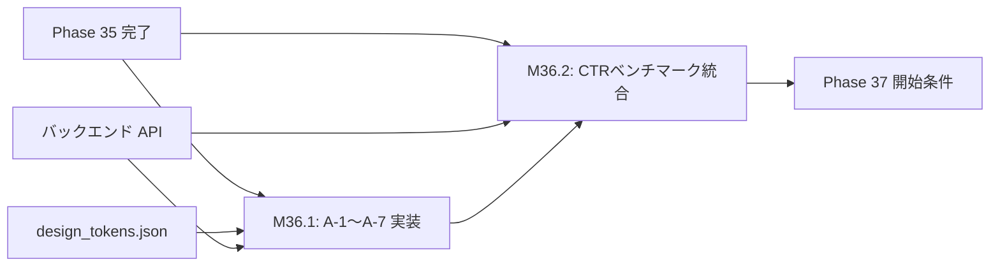

# 設計書ドラフト: Phase 36 — Admin Suite UI完成 & CTRベンチマーク統合

## 1. 概要

### 目的
Admin Suite（管理画面）の全7ダッシュボード画面（A-1〜A-7）を実装完了し、YouTuber CTRベンチマークのUI統合を行う。管理者がプロジェクト全体の健全性・パフォーマンス・品質指標を一元的に把握できるダッシュボードを提供する。

### スコープ
- A-1: プロジェクト概要ダッシュボード
- A-2: Flash/Opus セッション監視
- A-3: テスト & カバレッジ推移
- A-4: 技術負債管理
- A-5: 動画パイプライン進捗
- A-6: 品質スコアトレンド
- A-7: YouTuber CTRベンチマーク統合
- 共通: レスポンシブデザイン、ダークモード対応

### スコープ外
- ユーザー認証・認可（別フェーズで対応）
- モバイルアプリ対応

---

## 2. 前提条件

| 条件 | 値 | 根拠 |
|------|-----|------|
| Phase 35 ゲート通過済み | coverage_pct >= 55.0, critical_debt <= 5 | phase_gates.json |
| バックエンド API | 全エンドポイント稼働中 | API Router テスト全PASS |
| design_tokens.json | 最新状態 | ブランディング準拠 |
| draft_admin_suite.md | 設計承認済み | design_stock 既存ドラフト |

---

## 3. マイルストーン定義

### M36.1: A-1〜A-7 ダッシュボード画面実装

**完了条件:**
1. 全7画面が HTML/CSS/JavaScript で実装されていること
2. 各画面がバックエンド API からリアルタイムデータを取得・表示すること
3. レスポンシブデザイン（デスクトップ / タブレット / モバイル）対応
4. ダークモード切替が全画面で統一的に動作すること
5. UXストーリーに基づくブラウザE2Eテストが全PASS

**各画面の詳細仕様:**

| 画面ID | 画面名 | 主要データソース | 表示内容 |
|--------|--------|-----------------|----------|
| A-1 | プロジェクト概要 | phase_state.json, hub_state.json | 現在フェーズ、完了タスク数、ゲート進捗、直近イベント |
| A-2 | セッション監視 | flash_sessions/*.json | Flash/Opus セッション状態、心拍、バッチ進捗 |
| A-3 | テスト & カバレッジ | coverage.json, pytest結果 | カバレッジ推移グラフ、テスト数推移、失敗テスト一覧 |
| A-4 | 技術負債管理 | technical_debt_index.json | CRITICAL/HIGH/MEDIUM 別一覧、解消率トレンド |
| A-5 | 動画パイプライン | pipeline_status.json | 処理中動画一覧、ステージ進捗、エラー率 |
| A-6 | 品質スコアトレンド | quality_scores/*.json | 動画品質スコア推移、L1/L2検査結果 |
| A-7 | CTRベンチマーク | ctr_benchmark.json | サムネイルCTR予測、A/Bテスト結果 |

**UI設計原則:**
- glassmorphism スタイルのカード型レイアウト
- Chart.js によるインタラクティブグラフ
- CSS Grid / Flexbox によるレスポンシブ配置
- `design_tokens.json` のカラーパレット厳守
- アニメーション: フェードイン / スライドイン（200ms ease-out）

### M36.2: YouTuber CTRベンチマーク UI統合

**完了条件:**
1. A-7画面にCTRベンチマーク機能が統合されていること
2. サムネイルのCTR予測スコアが表示されること
3. 競合チャンネルとのCTR比較グラフが表示されること
4. A/Bテスト結果のサマリーが表示されること
5. CTRデータのCSVエクスポート機能が動作すること

**具体的な実装指針:**
- バックエンド: `backend/api/ctr_router.py` から CTR データを取得
- フロントエンド: Chart.js の棒グラフ + ヒートマップでCTR分布を可視化
- ベンチマーク基準: ジャンル別平均CTR（ゲーム: 5.2%, 教育: 3.8%, テック: 4.5%）
- A/Bテスト: サムネイルのバリエーション別CTR比較テーブル

---

## 4. タスクグループ定義

### test_weaver（配分: 25%）
- **対象**: 各ダッシュボード画面のAPIエンドポイント + フロントエンドユニットテスト
- **タスク粒度**: 1画面 = 1タスク（計7タスク）
- **具体的指示テンプレート**:
  ```
  A-{N} ダッシュボードのテストを作成せよ:
  - APIエンドポイントの正常系/異常系テスト
  - レスポンスの JSON スキーマバリデーション
  - フロントエンド: DOM要素の存在確認、データバインディングの検証
  - UXストーリー連動: ux_verification/stories/ にテストシナリオを追加
  ```
- **成功判定**: 対象テスト全PASS

### bug_hunter（配分: 15%）
- **対象**: 既存 Admin Suite 関連コードのバグ修正
- **タスク粒度**: バグ報告ベース
- **具体的指示テンプレート**:
  ```
  Admin Suite の以下のバグを調査・修正せよ:
  - ダッシュボードリンクのURLエンコード漏れ（GEMINI.md ダッシュボードリンク安全規約）
  - ダークモード切替時の色残り
  - リアルタイムデータ更新時のメモリリーク
  - get_rel_link() 経由のリンク生成を徹底
  ```
- **成功判定**: FF-27L テスト全PASS + 該当バグの再現テスト追加

### refactor（配分: 20%）
- **対象**: フロントエンドコードのコンポーネント化
- **タスク粒度**: 共通コンポーネント単位
- **具体的指示テンプレート**:
  ```
  ダッシュボード共通コンポーネントを抽出せよ:
  - カード型レイアウトコンポーネント
  - グラフ表示コンポーネント（Chart.js ラッパー）
  - データテーブルコンポーネント（ソート/フィルタ/ページネーション）
  - テーマ切替コンポーネント（ダークモード）
  ```
- **成功判定**: コンポーネント化後に全画面の表示が正常 + テスト全PASS

### coverage（配分: 30%）
- **対象**: カバレッジ 58% 達成
- **タスク粒度**: A/B/C分類に基づく優先度順
- **具体的指示テンプレート**:
  ```
  coverage 58% 達成に向けたテスト追加:
  - A分類: 新規実装の全ダッシュボード関連モジュール → 100%カバー
  - B分類: API Router、サービス層 → 推奨カバー
  - C分類: TDR登録
  - CTR関連エンドポイントのテストを重点的に追加
  ```
- **成功判定**: coverage_pct >= 58.0

### doc_gen（配分: 10%）
- **対象**: Admin Suite ユーザーガイド、API仕様書
- **タスク粒度**: 画面単位のドキュメント
- **具体的指示テンプレート**:
  ```
  以下のドキュメントを作成せよ:
  - Admin Suite 画面一覧と操作ガイド
  - 各APIエンドポイントの OpenAPI スキーマ
  - CTRベンチマークの解釈ガイド
  ```
- **成功判定**: ドキュメントがMarkdown形式で完成

---

## 5. リスクと緩和策

| リスク | 影響度 | 緩和策 |
|--------|--------|--------|
| フロントエンドのビルドエラー | 中 | ピュアHTML/CSS/JSで実装し、ビルドツール依存を最小化 |
| APIレスポンスの遅延によるUI表示崩れ | 中 | ローディングスケルトンUI + エラーフォールバック表示 |
| ダッシュボードリンク切れ | 高 | `get_rel_link()` 強制使用 + FF-27L 自動検証 |
| CTRデータの不正確さ | 中 | ベンチマーク基準値の出典を明記 + 信頼区間の表示 |
| レスポンシブ対応の工数超過 | 中 | モバイルファーストで設計し、デスクトップは後から拡張 |

---

## 6. 完了基準

| 基準 | 閾値 | 検証方法 |
|------|------|----------|
| coverage_pct | >= 58.0 | `pytest --cov` 実行結果 |
| critical_debt | <= 3 | `TechnicalDebtStore.get_open_critical_count()` |
| A-1〜A-7 全画面 | 表示正常 + データ取得成功 | ブラウザE2Eテスト |
| CTRベンチマーク統合 | A-7画面でCTRデータ表示 | ブラウザE2Eテスト |
| UXストーリー連動率 | >= 85% | `pytest tests/test_ux_ratchet.py` |
| ダッシュボードリンク | 全リンク有効 | FF-27L テスト |
| pytest 全テスト PASS | 0 failures | CI/CD パイプライン |

---

## 7. 依存関係


