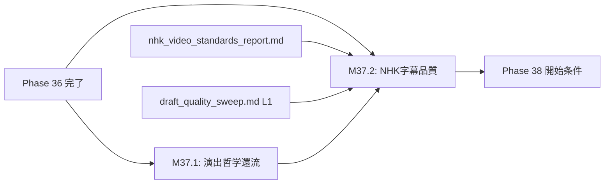

# 設計書ドラフト: Phase 37 — 演出哲学還流 & NHK字幕品質強化

## 1. 概要

### 目的
動画制作プロセスに「演出哲学還流エンジン」を組み込み、過去の動画制作から得た演出上の知見・パターンを自動的にフィードバックする仕組みを構築する。同時に、NHK基準の字幕品質スコア自動測定を実装し、プロフェッショナル品質の字幕生成を保証する。

### スコープ
- 演出哲学還流エンジン（`soul_feedback_engine.py`）の本格稼働
- NHK字幕品質スコア自動測定エンジン（`nhk_subtitle_scorer.py`）の実装
- 品質スコア 80点以上の自動達成
- `nhk_video_standards_report.md` 規格との整合性検証

### スコープ外
- 海外向け字幕（多言語対応）
- リアルタイム字幕生成（ライブ配信向け）

---

## 2. 前提条件

| 条件 | 値 | 根拠 |
|------|-----|------|
| Phase 36 ゲート通過済み | coverage_pct >= 58.0, critical_debt <= 3 | phase_gates.json |
| nhk_video_standards_report.md | 最新版 | NHK品質基準の原典 |
| youtuber_standards_personas.md | 最新版 | ペルソナ選定カタログ |
| draft_soul_narrative_feedback.md | 設計承認済み | design_stock 既存ドラフト |
| 動画パイプライン | 基本動作確認済み | Phase 36 で API 統合完了 |

---

## 3. マイルストーン定義

### M37.1: 演出哲学還流エンジン稼働

**完了条件:**
1. `soul_feedback_engine.py` が以下の機能を持ち、本格稼働していること:
   - 過去の動画品質スコア・視聴者エンゲージメントデータを分析
   - 演出パターン（テンポ、トランジション、テロップ配置、BGM選択）の傾向を抽出
   - 新規動画制作時に、演出改善提案を自動生成
   - 提案の根拠として過去データを引用（EBVP準拠）
2. 還流エンジンの出力が以下の構造化データであること:
   ```json
   {
     "suggestions": [
       {
         "category": "テンポ",
         "suggestion": "冒頭15秒のカット数を3→5に増加",
         "evidence": "過去5本の平均: 冒頭5カットの動画のCTRが12%高い",
         "priority": "high",
         "source_videos": ["video_001", "video_003"]
       }
     ],
     "overall_score": 85
   }
   ```
3. 演出提案が PROJECT_CONSTITUTION.md の品質基準と矛盾しないことの自動検証
4. テストカバレッジ: `soul_feedback_engine.py` のカバレッジ 80% 以上

**具体的な実装指針:**
- 過去データは `backend/data/video_analytics/` から読み込み
- 演出パターンの分類: テンポ / ビジュアル / オーディオ / テキスト の4カテゴリ
- 改善提案の優先度算出: 影響度（CTR相関）× 実装容易性
- 憲法（PROJECT_CONSTITUTION.md）との整合チェック: 禁止パターンリストとの照合

### M37.2: NHK字幕品質スコア自動測定 80点以上

**完了条件:**
1. `nhk_subtitle_scorer.py` が以下の品質指標を自動測定できること:

| 指標 | 測定方法 | 閾値 | 配点 |
|------|----------|------|------|
| 文字数/行 | 1行あたりの文字数 | ≤ 13文字/行 | 15点 |
| 表示時間 | 1字幕あたりの表示秒数 | 1.5〜7.0秒 | 15点 |
| 音声同期精度 | 音声開始からの遅延 | ≤ 200ms | 20点 |
| 句読点・改行 | 文法的に自然な改行位置 | 形態素解析ベース | 15点 |
| コントラスト比 | WCAG 2.1 基準 | ≥ 4.5:1 | 15点 |
| セーフエリア | 画面端からの距離 | ≥ 10% 内側 | 10点 |
| フォント一貫性 | 全字幕のフォント統一 | design_tokens準拠 | 10点 |

2. テストデータ（最低5本の動画字幕）に対して、スコアが **80点以上** であること
3. 80点未満の場合、具体的な改善指示を自動生成すること
4. `nhk_video_standards_report.md` の全基準項目との対応表が作成されていること

**具体的な実装指針:**
- 字幕ファイル（SRT/ASS形式）のパーサー実装
- 音声同期精度: `stable-ts` の出力タイムスタンプと字幕タイムスタンプの差分計算
- 形態素解析: `fugashi` + `unidic-lite` による改行位置の適切性判定
- コントラスト比: `draft_quality_sweep.md` の L1 フィルターを再利用
- セーフエリア: OpenCV による座標計算

---

## 4. タスクグループ定義

### test_weaver（配分: 30%）
- **対象**: `soul_feedback_engine.py`, `nhk_subtitle_scorer.py`
- **タスク粒度**: 品質指標単位（計7指標 + 還流エンジン4カテゴリ）
- **具体的指示テンプレート**:
  ```
  nhk_subtitle_scorer.py の {quality_metric} 測定機能をテストせよ:
  - 正常系: 基準を満たすSRTファイルで満点取得
  - 異常系: 基準を大幅に逸脱するSRTファイルで0点
  - 境界値: 閾値ちょうどのケース
  - テストデータは tests/fixtures/subtitles/ に配置
  ```
- **成功判定**: 全品質指標のテスト PASS

### bug_hunter（配分: 15%）
- **対象**: 字幕パイプライン、品質スコア計算のバグ
- **タスク粒度**: バグ報告ベース
- **具体的指示テンプレート**:
  ```
  字幕品質スコア計算の以下のエッジケースを修正せよ:
  - 空の字幕ファイル（0行）でのゼロ除算
  - BOM付きUTF-8ファイルのパースエラー
  - 2行字幕の文字数カウント（ルビ・改行を含む）
  - タイムスタンプが逆転しているSRTファイルの処理
  ```
- **成功判定**: エッジケーステスト追加 + 修正後 pytest 全PASS

### refactor（配分: 15%）
- **対象**: 既存の字幕生成・品質検証コードの統合
- **タスク粒度**: モジュール単位
- **具体的指示テンプレート**:
  ```
  draft_quality_sweep.md の L1 フィルター（コントラスト判定・セーフエリア判定）を
  nhk_subtitle_scorer.py から呼び出し可能な共通ライブラリに抽出せよ:
  - quality_metrics/contrast.py: コントラスト比計算
  - quality_metrics/safe_area.py: セーフエリア判定
  - 既存テストの更新
  ```
- **成功判定**: リファクタ後に pytest 全PASS + コード重複 0

### coverage（配分: 35%）
- **対象**: カバレッジ 62% 達成
- **タスク粒度**: A/B/C分類に基づく優先度順
- **具体的指示テンプレート**:
  ```
  coverage 62% 達成に向けたテスト追加:
  - A分類: soul_feedback_engine.py, nhk_subtitle_scorer.py → 100%カバー
  - B分類: 字幕パイプライン関連モジュール → 推奨カバー
  - C分類: TDR登録
  - 特に音声同期精度とコントラスト計算のカバレッジを重点強化
  ```
- **成功判定**: coverage_pct >= 62.0

### doc_gen（配分: 5%）
- **対象**: 品質基準ドキュメント
- **タスク粒度**: ドキュメント1件 = 1タスク
- **具体的指示テンプレート**:
  ```
  以下のドキュメントを更新せよ:
  - nhk_video_standards_report.md の品質指標対応表
  - 演出哲学還流エンジンの運用ガイド
  - NHK字幕品質スコアの解釈と改善アクション一覧
  ```
- **成功判定**: 既存規格ドキュメントとの整合性確認

---

## 5. リスクと緩和策

| リスク | 影響度 | 緩和策 |
|--------|--------|--------|
| NHK品質基準の解釈が主観的 | 高 | 定量的閾値を全指標に設定し、主観判定を排除 |
| 音声同期精度の測定が不安定 | 中 | `stable-ts` のバージョン固定 + フォールバック（手動アノテーション） |
| 演出還流が過学習（過去データに偏る） | 中 | 最新10本の動画に重み付け + 外部ベンチマーク参照 |
| 形態素解析の精度（専門用語） | 中 | ユーザー辞書の追加 + フォールバック（文字数ベース改行） |
| 80点未達成 | 高 | 各指標の配点バランスを調整可能な設計 + 個別改善アクション自動生成 |

---

## 6. 完了基準

| 基準 | 閾値 | 検証方法 |
|------|------|----------|
| coverage_pct | >= 62.0 | `pytest --cov` 実行結果 |
| critical_debt | == 0 | `TechnicalDebtStore.get_open_critical_count()` |
| 演出還流エンジン | 稼働確認 + テスト全PASS | pytest 実行結果 |
| NHK字幕品質スコア | テストデータ5本で 80点以上 | スコアラー実行結果 |
| 品質指標対応表 | 全7指標のカバー確認 | ドキュメントレビュー |
| pytest 全テスト PASS | 0 failures | CI/CD パイプライン |
| ラチェット非退行 | 全指標が前回以上 | `pytest tests/test_ux_ratchet.py` |

---

## 7. 依存関係


