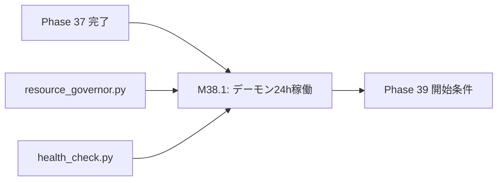

# 設計書ドラフト: Phase 38 — プロセスデーモン化 & 24時間無停止運用

## 1. 概要

### 目的
動画自動生成パイプライン全体をデーモンプロセスとして常駐化し、24時間無停止での自律運用を実現する。PC再起動、プロセスクラッシュ、リソース逼迫からの自動復旧機構を実装し、人的介入なしの持続稼働を保証する。

### スコープ
- デーモンプロセスマネージャ（`daemon_manager.py`）の実装
- プロセス監視 & 自動復旧（Watchdog）
- リソースガバナーとの統合（動的リソース適応型並列制御規約 準拠）
- 24時間無停止稼働テスト
- ログローテーション & ヘルスチェックエンドポイント

### スコープ外
- Kubernetes / Docker によるコンテナ化（将来フェーズ）
- マルチマシン分散（単一マシンスコープ）

---

## 2. 前提条件

| 条件 | 値 | 根拠 |
|------|-----|------|
| Phase 37 ゲート通過済み | coverage_pct >= 62.0, critical_debt == 0 | phase_gates.json |
| resource_governor.py | 稼働中 | 動的リソース適応型並列制御規約 |
| health_check.py | 3段階自動停止実装済み | 心拍レジリエンス規約 |
| Flash完遂後リソース解放規約 | 適用中 | GEMINI.md |
| Windows OS | 対象環境 | ユーザー環境 |

---

## 3. マイルストーン定義

### M38.1: デーモンプロセス 24h 無停止稼働テスト PASS

**完了条件:**
1. `daemon_manager.py` が以下の機能を持ち、24時間連続稼働テストに合格すること:

**プロセスライフサイクル管理:**
- デーモンとしてバックグラウンド起動（Windows: `pythonw.exe` + `win32service` または `subprocess.CREATE_NO_WINDOW`）
- PIDファイルによるプロセス管理（`/tmp/video_automation.pid`）
- シグナルハンドリング（graceful shutdown: SIGTERM / SIGINT）
- 起動時の重複プロセス検出 & 既存プロセスの安全な終了

**自動復旧（Watchdog）:**
- 子プロセス（FFmpeg、APIサーバー等）のクラッシュ検出（5秒間隔ポーリング）
- クラッシュ時の自動再起動（最大3回 / 1時間、Exponential Backoff: 10s→30s→90s）
- 3回連続クラッシュ → エスカレーション（ログ出力 + 管理者通知）
- クラッシュ原因の自動分類: OOM / Segfault / Unhandled Exception / Timeout

**リソース管理:**
- `resource_governor.py` との統合:
  - 🟢 NORMAL (CPU<50%, メモリ<63%): 通常稼働
  - 🟡 CAUTION (CPU≥50% OR メモリ≥63%): 新規タスク起動30秒遅延
  - 🔴 CRITICAL (CPU≥70% OR メモリ≥75%): 新規タスク起動停止
- メモリリーク検出: 30分ごとのメモリ使用量トレンド監視（単調増加3回 → 警告）
- ディスク容量監視: 空き容量 < 5GB → 一時ファイル自動クリーンアップ

**ログ管理:**
- ログローテーション: 日次ローテーション、7日間保持、圧縮アーカイブ
- 構造化ログ（JSON Lines形式）: タイムスタンプ、レベル、モジュール、メッセージ
- ヘルスチェックエンドポイント: `GET /health` → `{"status": "ok", "uptime_seconds": N, "resource_state": "NORMAL"}`

2. 24時間無停止稼働テストの合格条件:

| テスト項目 | 合格基準 |
|-----------|----------|
| 連続稼働時間 | 24時間以上 |
| 自動復旧成功率 | 100%（シミュレートされたクラッシュ3回全て復旧） |
| メモリリーク | 24時間後のメモリ使用量が起動時の 150% 以内 |
| CPU使用率平均 | 50% 以下（アイドル時） |
| ログ出力正常性 | 全ログエントリがJSON Lines形式 |
| ヘルスチェック応答 | 全時点で 200 OK |
| graceful shutdown | SIGTERM 受信後 30秒以内に全子プロセス終了 |

**具体的な実装指針:**
- Windows環境: `subprocess.CREATE_NO_WINDOW` フラグでバックグラウンド起動
- PIDファイル: `backend/tmp/daemon.pid` に書き込み、起動時にstaleチェック
- Watchdog: `threading.Thread(daemon=True)` でプロセス監視スレッドを常駐
- テスト: `pytest` で 24h テストを実行（実際には高速シミュレーション: 24h = 24分に時間圧縮）

---

## 4. タスクグループ定義

### test_weaver（配分: 35%）
- **対象**: `daemon_manager.py`, Watchdog, リソースガバナー統合
- **タスク粒度**: 機能単位
- **具体的指示テンプレート**:
  ```
  daemon_manager.py の {target_function} をテストせよ:
  - プロセス起動/停止のライフサイクルテスト
  - PIDファイルのstaleチェック（プロセスが存在しないPIDファイル）
  - クラッシュ検出 → 自動再起動（MagicMockでプロセスクラッシュをシミュレート）
  - 3回連続クラッシュ → エスカレーション
  - subprocess.Popen モック: poll()=0, readline()="" 準拠
  - テストタイムアウト: 60秒（GEMINI.md pytest.ini 準拠）
  ```
- **成功判定**: daemon_manager.py のカバレッジ 80% 以上

### bug_hunter（配分: 15%）
- **対象**: 既存のプロセス管理・ヘルスチェックコードのバグ
- **タスク粒度**: バグ報告ベース
- **具体的指示テンプレート**:
  ```
  プロセス管理の以下のエッジケースを修正せよ:
  - PIDファイルのロック競合（複数インスタンス同時起動）
  - Windows でのシグナルハンドリング制限（SIGTERM の代替）
  - graceful shutdown 中の新規タスク受付防止
  - resource_governor のCRITICAL状態からの復旧タイミング
  ```
- **成功判定**: エッジケーステスト追加 + 修正後 pytest 全PASS

### refactor（配分: 15%）
- **対象**: health_check.py, resource_governor.py のデーモン対応リファクタ
- **タスク粒度**: モジュール単位
- **具体的指示テンプレート**:
  ```
  既存のヘルスチェック・リソースガバナーをデーモンモードに対応させよ:
  - health_check.py: デーモンの心拍を監視対象に追加
  - resource_governor.py: デーモン自身のリソース消費を監視対象に含める
  - ログ出力をJSON Lines形式に統一
  ```
- **成功判定**: リファクタ後に pytest 全PASS

### coverage（配分: 30%）
- **対象**: カバレッジ 65% 達成
- **タスク粒度**: A/B/C分類に基づく優先度順
- **具体的指示テンプレート**:
  ```
  coverage 65% 達成に向けたテスト追加:
  - A分類: daemon_manager.py → 100%カバー
  - B分類: health_check.py, resource_governor.py → 推奨カバー
  - C分類: TDR登録
  - プロセスライフサイクルのテストを重点的に追加
  ```
- **成功判定**: coverage_pct >= 65.0

### doc_gen（配分: 5%）
- **対象**: デーモン運用ガイド
- **タスク粒度**: ドキュメント1件 = 1タスク
- **具体的指示テンプレート**:
  ```
  以下のドキュメントを作成せよ:
  - デーモンプロセスの起動/停止手順書
  - Watchdogの設定パラメータ一覧
  - トラブルシューティングガイド（クラッシュ原因別の対処法）
  - リソースガバナー閾値の調整手順
  ```
- **成功判定**: 運用ガイドが Markdown 形式で完成

---

## 5. リスクと緩和策

| リスク | 影響度 | 緩和策 |
|--------|--------|--------|
| Windows 環境でのデーモン化制限 | 高 | `pythonw.exe` + `CREATE_NO_WINDOW` での代替実装。将来的に `win32service` 化を検討 |
| 24hテストの実行時間 | 高 | 時間圧縮シミュレーション（24h → 24分）で高速テスト。本番前に実時間テストも実施 |
| メモリリーク見逃し | 中 | `tracemalloc` によるメモリプロファイリング + 30分ごとのスナップショット比較 |
| Watchdogの無限再起動ループ | 高 | 3回連続クラッシュで自動停止 + Exponential Backoff |
| リソースガバナーの閾値不適切 | 中 | PDCA月次レビュー（動的リソース適応型並列制御規約 準拠） |

---

## 6. 完了基準

| 基準 | 閾値 | 検証方法 |
|------|------|----------|
| coverage_pct | >= 65.0 | `pytest --cov` 実行結果 |
| critical_debt | == 0 | `TechnicalDebtStore.get_open_critical_count()` |
| 24h無停止稼働テスト | 全項目PASS | テスト実行結果レポート |
| 自動復旧成功率 | 100% | Watchdog テスト結果 |
| メモリリーク | 24h後 150% 以内 | メモリプロファイリング結果 |
| pytest 全テスト PASS | 0 failures | CI/CD パイプライン |
| ラチェット非退行 | 全指標が前回以上 | `pytest tests/test_ux_ratchet.py` |

---

## 7. 依存関係


