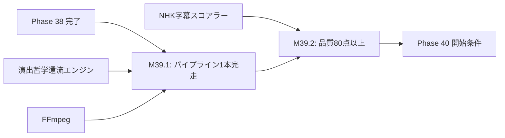

# 設計書ドラフト: Phase 39 — パイプライン統合 & 動画生成E2E

## 1. 概要

### 目的
RAW動画素材から最終動画までの全自動パイプラインを統合し、エンドツーエンド（E2E）での1本完走を達成する。品質スコア80点以上の動画を人的介入なしに自動生成できることを実証する。

### スコープ
- 全パイプラインステージの統合テスト
- RAW動画 → 最終動画の自動パイプライン1本完走
- 品質スコア80点以上の動画自動生成
- パイプラインエラーハンドリング & リトライ機構
- Progressive Preview による中間確認

### スコープ外
- 複数動画の同時並行生成（Phase 40 で対応）
- YouTube への自動アップロード（別フェーズ）

---

## 2. 前提条件

| 条件 | 値 | 根拠 |
|------|-----|------|
| Phase 38 ゲート通過済み | coverage_pct >= 65.0, critical_debt == 0 | phase_gates.json |
| デーモンプロセス | 24h稼働テスト PASS済み | Phase 38 完了 |
| NHK字幕品質スコアラー | 稼働中（80点以上達成済み） | Phase 37 完了 |
| 演出哲学還流エンジン | 稼働中 | Phase 37 完了 |
| FFmpeg | インストール済み | 動画エンコード必須 |
| draft_progressive_preview_gate.md | 設計承認済み | design_stock |

---

## 3. マイルストーン定義

### M39.1: RAW動画 → 最終動画の自動パイプライン1本完走

**完了条件:**
1. 以下の全パイプラインステージが連続して正常完了すること:

| ステージ | 入力 | 出力 | 担当モジュール |
|----------|------|------|---------------|
| S1: 素材取込 | RAW動画ファイル | 正規化された動画 + メタデータ | `ingest_service.py` |
| S2: 音声抽出 | 正規化動画 | 音声ファイル (WAV) | `audio_extractor.py` |
| S3: 文字起こし | 音声ファイル | トランスクリプト (JSON) | `transcription_service.py` |
| S4: 字幕生成 | トランスクリプト | SRTファイル | `subtitle_generator.py` |
| S5: 演出提案 | メタデータ + 過去データ | 演出指示 (JSON) | `soul_feedback_engine.py` |
| S6: テロップ生成 | 演出指示 + design_tokens | テロップ画像群 | `telop_renderer.py` |
| S7: 編集・合成 | 全中間成果物 | 最終動画 (MP4) | `video_composer.py` |
| S8: 品質検証 | 最終動画 | 品質スコアレポート | `quality_gate.py` |
| S9: サムネイル生成 | 最終動画 + ブランド素材 | サムネイル画像 | `thumbnail_generator.py` |

2. パイプライン全体の処理時間が入力動画の長さの **5倍以内** であること（10分動画 → 50分以内）
3. 全ステージ間のデータ受け渡しが構造化された中間フォーマットであること（JSON + ファイルパス）
4. パイプライン実行ログが `event_log.jsonl` に全ステージの開始/完了/エラーを記録すること

**具体的な実装指針:**
- `pipeline_coordinator.py` を拡張し、全ステージを逐次実行するオーケストレーション
- 各ステージ間の中間成果物は `backend/tmp/pipeline/{job_id}/` に保存
- ステージ失敗時: 最大2回リトライ → 3回目失敗でパイプライン停止 + エラーレポート
- Progressive Preview: S6（テロップ生成）完了時点でプレビューを自動生成

### M39.2: 品質スコア80点以上の動画自動生成

**完了条件:**
1. M39.1 で生成された動画が以下の品質基準を全て満たすこと:

| 品質指標 | 閾値 | 測定方法 |
|----------|------|----------|
| NHK字幕品質スコア | >= 80点 | `nhk_subtitle_scorer.py` |
| コントラスト比 | >= 4.5:1 (WCAG 2.1) | L1フィルター |
| セーフエリア準拠 | 100% | 座標計算 |
| 音声ラウドネス | -14 LUFS ± 1 | FFmpeg loudnorm |
| エンコード品質 | CRF ≤ 23 (H.264) | FFmpeg出力パラメータ |
| フレームドロップ | 0 | FFmpeg ログ解析 |
| 総合品質スコア | >= 80点 | 加重平均 |

2. 品質ゲート（`quality_gate.py`）が自動的にPASS/FAIL判定を行うこと
3. FAIL判定の場合、具体的な改善指示と問題箇所のスクリーンショットを含むレポートが生成されること
4. テストデータ（最低3本のRAW動画）で品質スコア80点以上を達成すること

**具体的な実装指針:**
- 品質ゲート: Phase 37 の `nhk_subtitle_scorer.py` + Phase 36 の L1/L2 フィルターを統合
- 音声ラウドネス: `ffmpeg -i input.mp4 -af loudnorm=I=-14:LRA=11:TP=-1.5 -f null -` で測定
- 総合品質スコア: 字幕(30点) + ビジュアル(30点) + 音声(20点) + エンコード(20点) の加重平均
- FAIL時の自動改善: 低スコア項目を特定し、該当ステージのパラメータ調整 → 再実行

---

## 4. タスクグループ定義

### test_weaver（配分: 30%）
- **対象**: パイプライン各ステージ + 統合テスト
- **タスク粒度**: ステージ単位（計9ステージ） + 統合テスト
- **具体的指示テンプレート**:
  ```
  パイプラインステージ {stage_name} のテストを作成せよ:
  - 正常系: 正規入力での正常完了
  - 異常系: 不正な入力ファイル、タイムアウト、ディスク容量不足
  - 統合テスト: S1→S2→...→S9 の連続実行（モック使用）
  - FFmpeg呼び出し: safe_popen_mock fixture 使用必須
  - テストデータ: tests/fixtures/pipeline/ に配置
  ```
- **成功判定**: 全ステージテスト PASS + 統合テスト PASS

### bug_hunter（配分: 20%）
- **対象**: パイプライン統合時のバグ修正
- **タスク粒度**: バグ報告ベース
- **具体的指示テンプレート**:
  ```
  パイプライン統合の以下のバグを調査・修正せよ:
  - ステージ間のファイルパス参照エラー（Windows パス区切り）
  - FFmpeg プロセスのゾンビ化（完了しないプロセスの検出）
  - 中間ファイルのクリーンアップ漏れ（ディスク容量圧迫）
  - 大容量RAW動画（1GB超）でのメモリ不足
  - エンコード設定のデフォルト値不正
  ```
- **成功判定**: バグ修正 + 再現テスト追加 + pytest 全PASS

### refactor（配分: 15%）
- **対象**: パイプラインコードの統合・最適化
- **タスク粒度**: モジュール単位
- **具体的指示テンプレート**:
  ```
  パイプラインの以下の最適化を実施せよ:
  - pipeline_coordinator.py: ステージ間の中間データをストリーミング化
  - 共通エラーハンドリング: 全ステージで統一されたエラーレポート形式
  - 設定の外部化: エンコードパラメータを config.json に集約
  - ログの構造化: 全ステージで JSON Lines ログを統一
  ```
- **成功判定**: リファクタ後に pytest 全PASS + パイプライン完走確認

### coverage（配分: 30%）
- **対象**: カバレッジ 68% 達成
- **タスク粒度**: A/B/C分類に基づく優先度順
- **具体的指示テンプレート**:
  ```
  coverage 68% 達成に向けたテスト追加:
  - A分類: pipeline_coordinator.py, quality_gate.py, video_composer.py → 100%カバー
  - B分類: 各ステージモジュール → 推奨カバー
  - C分類: TDR登録
  - 特にエラーハンドリングパスのカバレッジを重点強化
  ```
- **成功判定**: coverage_pct >= 68.0

### doc_gen（配分: 5%）
- **対象**: パイプライン運用ガイド
- **タスク粒度**: ドキュメント1件 = 1タスク
- **具体的指示テンプレート**:
  ```
  以下のドキュメントを作成せよ:
  - 動画生成パイプライン全体フロー図（Mermaid）
  - 各ステージの設定パラメータ一覧
  - 品質ゲートの判定基準と改善アクション一覧
  - トラブルシューティングガイド（FFmpegエラー別の対処法）
  ```
- **成功判定**: ドキュメント完成 + Mermaid図を含む

---

## 5. リスクと緩和策

| リスク | 影響度 | 緩和策 |
|--------|--------|--------|
| FFmpegのバージョン依存バグ | 高 | FFmpeg バージョン固定（6.x系） + CI/CDでバージョンチェック |
| RAW動画のフォーマット多様性 | 高 | S1（素材取込）で正規化し、以降ステージはMP4/WAVのみ受付 |
| パイプライン処理時間の超過 | 中 | 処理時間上限（入力長の5倍）の設定 + タイムアウト自動停止 |
| 品質スコア80点未達成 | 高 | 各品質指標のボトルネック特定 → 個別ステージのパラメータチューニング |
| 中間ファイルのディスク圧迫 | 中 | パイプライン完了後の自動クリーンアップ + ディスク容量監視 |
| Windows パス問題 | 中 | `pathlib.Path` の統一使用 + テストでのWindows/Unix両パスチェック |

---

## 6. 完了基準

| 基準 | 閾値 | 検証方法 |
|------|------|----------|
| coverage_pct | >= 68.0 | `pytest --cov` 実行結果 |
| critical_debt | == 0 | `TechnicalDebtStore.get_open_critical_count()` |
| パイプライン1本完走 | S1→S9 正常完了 | E2Eテスト実行結果 |
| 品質スコア | >= 80点（3本のテストデータ） | 品質ゲート実行結果 |
| 処理時間 | 入力動画長の5倍以内 | タイマー計測 |
| pytest 全テスト PASS | 0 failures | CI/CD パイプライン |
| ラチェット非退行 | 全指標が前回以上 | `pytest tests/test_ux_ratchet.py` |

---

## 7. 依存関係


