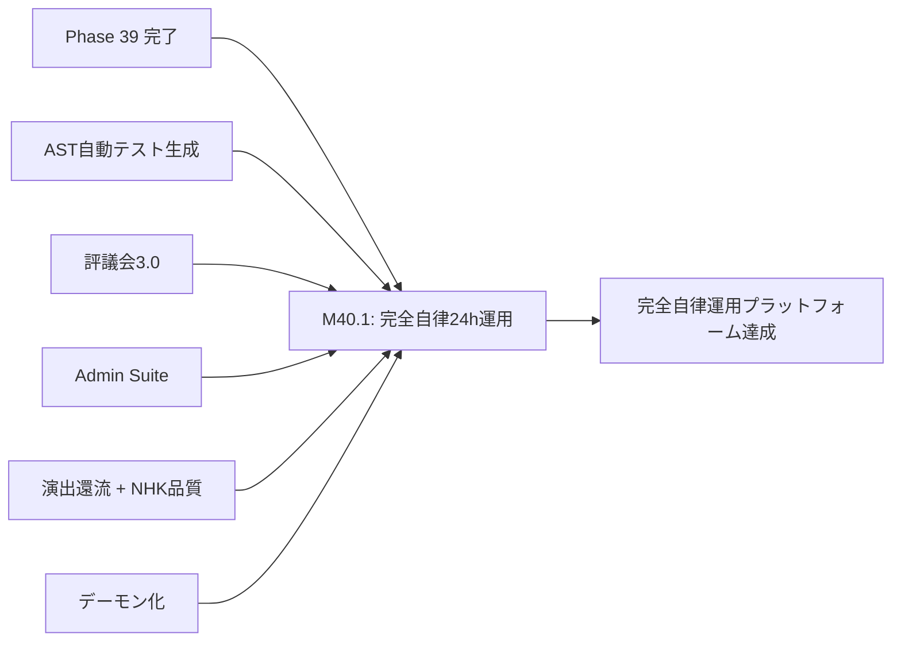

# 設計書ドラフト: Phase 40 — 完全自律運用 & 品質保証ゲート

## 1. 概要

### 目的
ユーザー介入ゼロでの24時間自律運用を実証し、カバレッジ70%到達・テスト数2500件以上を達成する。これまでの全フェーズで構築した基盤（デーモン化、パイプライン統合、品質ゲート、評議会、リソースガバナー）を統合し、「完全自律動画生成プラットフォーム」としての最終品質保証を行う。

### スコープ
- ユーザー介入0での24時間運用テスト
- カバレッジ 70% 達成
- テスト数 2500件 以上
- 全コンポーネントの統合稼働検証
- 品質保証ゲートの最終検証
- 運用ドキュメント完成

### スコープ外
- 新機能の追加（安定化・品質保証に集中）
- 外部サービス連携（YouTube API等）

---

## 2. 前提条件

| 条件 | 値 | 根拠 |
|------|-----|------|
| Phase 39 ゲート通過済み | coverage_pct >= 68.0, critical_debt == 0 | phase_gates.json |
| パイプライン1本完走 | 達成済み | Phase 39 M39.1 |
| 品質スコア80点以上 | 達成済み | Phase 39 M39.2 |
| デーモン24h稼働 | テスト PASS済み | Phase 38 M38.1 |
| 全GEMINI.md規約 | 適用中 | 全規約準拠 |

---

## 3. マイルストーン定義

### M40.1: ユーザー介入0で24h運用テストPASS + Coverage 70%

**完了条件:**

#### A. 24時間自律運用テスト

1. 以下のシナリオを24時間連続で自動実行し、全項目PASSすること:

| テスト項目 | 合格基準 | 検証方法 |
|-----------|----------|----------|
| デーモン連続稼働 | 24h中断なし | PIDファイル + ヘルスチェック |
| パイプライン自動実行 | 3本以上の動画を自動生成 | パイプラインログ |
| 品質ゲート | 全動画で80点以上 | 品質スコアレポート |
| 自動復旧 | 注入されたクラッシュから100%復旧 | Watchdogログ |
| リソースガバナー | CRITICAL状態なし | resource_state.json |
| 評議会合意 | 設計判断時に自動合意形成 | 議事録 |
| 演出還流 | 2本目以降の動画に還流提案が反映 | 還流ログ |
| ログローテーション | 日次ローテーション正常 | ログファイル |
| ユーザー介入 | 0回 | 操作ログ（介入なし） |
| メモリ安定性 | 起動時の150%以内 | メモリプロファイリング |

2. テスト中に発生した全イベントが `event_log.jsonl` に記録されていること
3. テスト終了後の自動レポート生成:
   - 24時間の稼働サマリー
   - 各コンポーネントの稼働率
   - 生成された動画の品質スコア一覧
   - リソース使用推移グラフ

#### B. カバレッジ 70% + テスト数 2500件

1. `pytest --cov` の結果が **70.0% 以上** であること
2. テスト総数が **2500件 以上** であること
3. カバレッジ改善規約に基づくA/B/C分類:
   - A分類（Phase 40で直接変更するモジュール）: 100%カバー
   - B分類（依存基盤）: 推奨カバー
   - C分類: TDR登録で管理

#### C. 品質保証ゲート最終検証

1. 以下の全品質ゲートが自動的にPASS/FAIL判定を行えること:

| ゲート | 判定基準 | 自動化レベル |
|--------|----------|-------------|
| テストゲート | pytest 全PASS + カバレッジ非退行 | 完全自動 |
| 品質ゲート | 動画品質スコア >= 80点 | 完全自動 |
| 負債ゲート | critical_debt == 0 | 完全自動 |
| ラチェットゲート | 全指標が前回以上 | 完全自動 |
| 心拍ゲート | 全デーモン/エージェントの心拍正常 | 完全自動 |
| リソースゲート | CRITICAL状態なし | 完全自動 |

2. ゲート失敗時の自動エスカレーション:
   - テストゲート失敗 → 3回連続 FAIL で即停止（EP条件）
   - 品質ゲート失敗 → 該当動画のパイプライン再実行（最大2回）
   - 負債ゲート失敗 → TDR一覧レポート生成
   - リソースゲート失敗 → リソース解放 + CAUTION状態で一時停止

**具体的な実装指針:**

- 24h テスト: `autonomous_operation_test.py` として実装
  - 時間圧縮モード（24h → 24分）と実時間モードの両方を用意
  - テストRAW動画: `tests/fixtures/raw_videos/` に3本配置（30秒 / 1分 / 3分）
  - クラッシュ注入: `fault_injector.py` でランダムなタイミングでプロセスkillをシミュレート
- カバレッジ 70%:
  - Phase 34 の `ast_test_generator.py` を活用して未カバーモジュールのテストを自動生成
  - `InlineCoverageExtender` による行レベルのカバレッジ分析
- テスト 2500件:
  - Phase 34〜39 で追加された全テストのカウント
  - パラメタライズドテスト（`@pytest.mark.parametrize`）の活用

---

## 4. タスクグループ定義

### test_weaver（配分: 40%）
- **対象**: 24h運用テスト、統合テスト、カバレッジ向上テスト
- **タスク粒度**: コンポーネント単位
- **具体的指示テンプレート**:
  ```
  テスト数 2500件達成に向けて {target_module} のテストを追加せよ:
  - AST解析テスト生成（ast_test_generator.py）を活用
  - パラメタライズドテストで入力バリエーションを網羅
  - エッジケース: 空入力、巨大入力、不正フォーマット
  - 統合テスト: モジュール間の連携テスト
  - 24h運用テストのシナリオテスト
  ```
- **成功判定**: test_count >= 2500 + coverage_pct >= 70.0

### bug_hunter（配分: 15%）
- **対象**: 統合テストで発見されたバグ
- **タスク粒度**: バグ報告ベース
- **具体的指示テンプレート**:
  ```
  24h運用テスト中に検出された以下のバグを修正せよ:
  - 長時間稼働時のファイルハンドルリーク
  - 並行パイプライン実行時のリソース競合
  - 評議会の合意結果がパイプラインに反映されないケース
  - ログローテーション中のログ欠損
  - graceful shutdown 時の中間ファイル残留
  ```
- **成功判定**: バグ修正 + 再現テスト追加 + 24h運用テスト再実行PASS

### refactor（配分: 15%）
- **対象**: 全コードベースの最終品質改善
- **タスク粒度**: モジュール単位
- **具体的指示テンプレート**:
  ```
  コードベースの最終品質改善を実施せよ:
  - 技術負債台帳の残件（MEDIUM以下）の解消
  - 全モジュールの docstring 完備確認
  - 型ヒントの完備（mypy strict モード対応）
  - 不要な import の除去
  - 重複コードの最終 DRY 化
  ```
- **成功判定**: critical_debt == 0 + リファクタ後 pytest 全PASS

### coverage（配分: 25%）
- **対象**: カバレッジ 70% 達成の最終追い込み
- **タスク粒度**: A/B/C分類に基づく優先度順
- **具体的指示テンプレート**:
  ```
  coverage 70% 最終達成:
  - A分類: autonomous_operation_test.py, fault_injector.py → 100%カバー
  - B分類: 全パイプラインステージモジュール → 推奨カバー
  - C分類: TDR登録（Phase 40 以降で解消）
  - InlineCoverageExtender で未カバー行を特定し、重点テスト追加
  - パラメタライズドテストで効率的にカバレッジ向上
  ```
- **成功判定**: coverage_pct >= 70.0

### doc_gen（配分: 5%）
- **対象**: 最終運用ドキュメント一式
- **タスク粒度**: ドキュメントカテゴリ単位
- **具体的指示テンプレート**:
  ```
  以下の最終ドキュメントを作成せよ:
  - 完全自律運用マニュアル（起動/停止/監視/トラブルシューティング）
  - システムアーキテクチャ図（全コンポーネントの依存関係 Mermaid図）
  - 品質保証ゲート一覧と判定基準
  - 24h運用テスト結果レポートテンプレート
  - Phase 34〜40 の成果サマリー
  ```
- **成功判定**: 全ドキュメント完成

---

## 5. リスクと緩和策

| リスク | 影響度 | 緩和策 |
|--------|--------|--------|
| カバレッジ 70% 未達成 | 高 | Phase 34 のAST自動テスト生成を活用。未カバーモジュールのA/B/C分類で優先度明確化 |
| テスト数 2500件 未達成 | 中 | パラメタライズドテストの積極活用。Phase 34〜39 の全テスト資産の棚卸し |
| 24h運用テストでの未知バグ | 高 | 時間圧縮テストで事前にバグを検出。本番テスト前に3回のドライランを実施 |
| リソース逼迫によるUI フリーズ | 高 | 動的リソース適応型並列制御規約の段階的ウォームアップを厳守 |
| 品質スコアの揺らぎ | 中 | テストデータの固定（再現可能なRAW動画セット）+ スコアの信頼区間計算 |
| 技術負債のクリーンアップ漏れ | 中 | TDR台帳の全件レビュー + critical_debt == 0 の自動検証 |

---

## 6. 完了基準

| 基準 | 閾値 | 検証方法 |
|------|------|----------|
| coverage_pct | >= 70.0 | `pytest --cov` 実行結果 |
| critical_debt | == 0 | `TechnicalDebtStore.get_open_critical_count()` |
| test_count | >= 2500 | `pytest --co -q \| wc -l` |
| 24h運用テスト | 全項目PASS | テスト実行結果レポート |
| ユーザー介入 | 0回 | 操作ログ |
| 品質ゲート | 全動画 >= 80点 | 品質スコアレポート |
| 全品質保証ゲート | 6ゲート全PASS | 統合ゲート検証 |
| pytest 全テスト PASS | 0 failures | CI/CD パイプライン |
| ラチェット非退行 | 全指標が前回以上 | `pytest tests/test_ux_ratchet.py` |

---

## 7. 依存関係



---

## 8. Phase 40 達成後の展望

Phase 40 の完了は、動画自動生成プラットフォームの「完全自律運用」マイルストーンの達成を意味する。以下は Phase 41 以降の展望:

- **Phase 41+**: YouTube API 自動アップロード統合
- **Phase 42+**: マルチチャンネル対応
- **Phase 43+**: A/Bテスト自動実行 & サムネイル最適化
- **Phase 44+**: 視聴者フィードバック自動分析 & コンテンツ戦略AI
